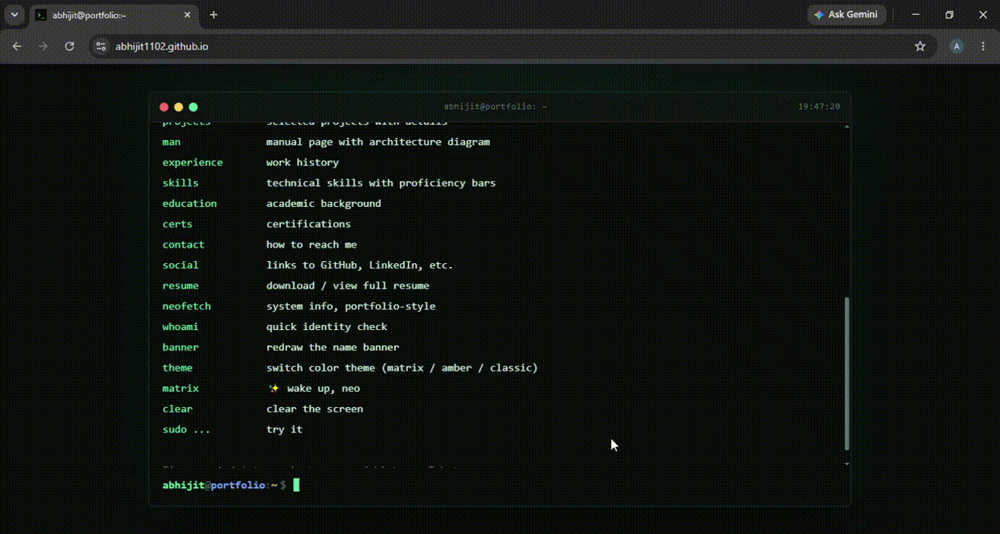
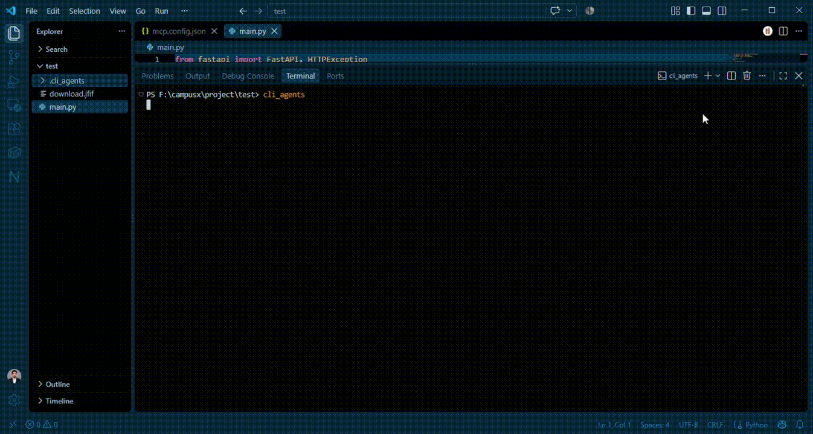
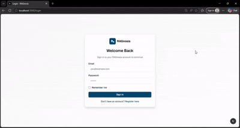

<h1 align="center">Hi 👋, I'm Abhijit Rajkumar</h1>
<h3 align="center">AI/ML Engineer & Full-Stack Developer</h3>
<p align="center">Building intelligent applications with LLMs, RAG, AI Agents, FastAPI, Next.js & modern cloud technologies.</p>

<p align="center">
  <a href="https://github.com/Abhijit1102"></a>
  <a href="https://www.linkedin.com/in/abhi-ai-automation"></a>
  <a href="https://abhijit1102.github.io"></a>
  <a href="mailto:abhijitrajkumar2@gmail.com"></a>
</p>

<p align="center">
  📍 Remote-friendly &nbsp;|&nbsp; 🇮🇳 India
</p>

---

## 🖥️ Interactive Portfolio

<p align="center">
  
</p>

<p align="center">
  <a href="https://abhijit1102.github.io">
    🚀 View My Interactive Portfolio
  </a>
</p>

> **Note:** `assets/portfolio-demo.gif` needs to be generated and added — see the **Portfolio GIF Prompt** section below.

---

## 👋 About Me

I'm an **AI/ML Engineer and Full-Stack Developer** who builds end-to-end, production-style applications that combine **LLMs, Retrieval-Augmented Generation (RAG), and AI Agents** with modern full-stack engineering.

- 🔭 Currently working as an **AI/ML Intern at Euron**, building **MediRAG (RAGnosis)** — a full-stack, RAG-powered medical document analysis system.
- 🧠 I design end-to-end AI pipelines: document ingestion → embeddings → vector search → LLM-grounded response generation.
- ⚡ On the full-stack side, I build with **Next.js, React, FastAPI, Node.js**, and databases like **PostgreSQL, MongoDB, Pinecone, and Qdrant**.
- 📊 I also have hands-on experience with **Big Data tooling** — Hadoop, Spark, Kafka, and cloud data pipelines on AWS and Azure.
- 🎓 I hold a **B.Sc. in Mathematics**, which grounds my ML/algorithmic work in a strong analytical foundation.
- 🚀 I enjoy building **AI-powered SaaS products, coding agents, RAG applications, and developer tools**.

---

## 🧰 Tech Stack

**Languages**
<p>


</p>

**Frontend**
<p>


</p>

**Backend**
<p>


</p>

**AI / ML / LLMs**
<p>


</p>

**Databases / Vector DBs**
<p>


</p>

**Cloud / DevOps**
<p>


</p>

**Big Data**
<p>


</p>

---

## 📊 GitHub Statistics

<!--STATS:START-->
## 📊 GitHub Statistics

| Metric | Value |
|---|---:|
| 📦 Public Repositories | **98** |
| ⭐ Stars Received | **3** |
| 🍴 Forks Received | **0** |
| 🔥 Contributions (Last Year) | **470** |

### ⭐ Top Starred Repositories

| Repository | ⭐ Stars | 🍴 Forks |
|---|---:|---:|
| [career_ai](https://github.com/Abhijit1102/career_ai) | ⭐ 1 | 🍴 0 |
| [DjangoBotHub](https://github.com/Abhijit1102/DjangoBotHub) | ⭐ 1 | 🍴 0 |
| [pwskill_assign](https://github.com/Abhijit1102/pwskill_assign) | ⭐ 1 | 🍴 0 |
| [10.-Diabetes-Deployment-With-BeanStalk](https://github.com/Abhijit1102/10.-Diabetes-Deployment-With-BeanStalk) | ⭐ 0 | 🍴 0 |
| [Abhijit1102](https://github.com/Abhijit1102/Abhijit1102) | ⭐ 0 | 🍴 0 |

### 💻 Top Languages

| Language | Share |
|---|---:|
| Jupyter Notebook | 91.6% |
| JavaScript | 1.9% |
| C | 1.9% |
| Tcl | 1.6% |
| Python | 1.2% |
| TypeScript | 1.2% |

**🔥 470 contributions in the last year**

_Last updated automatically by `scripts/generate_stats.py` via GitHub Actions._
<!--STATS:END-->

---

## 🔭 Currently Building

- 🏥 **🤖 CLI Agents**  an AI-powered GitHub orchestration system that uses intelligent agents to automate repository workflows, task execution, and developer operations directly from the command line.

<p align="center">
  
</p

---

## 🎯 Focus Areas

- AI Engineering & LLM Application Development
- Retrieval-Augmented Generation (RAG)
- AI Agents & Autonomous Coding Agents
- Generative AI
- Full-Stack Development (Next.js, React, FastAPI, Node.js)
- Backend & API Engineering
- Data Engineering & Big Data Pipelines
- Cloud & DevOps (AWS, GCP, Docker, Kubernetes)

---

## 🚀 Recently Completed

- 🧠 **📚 RAG AI Application** — A full-stack Retrieval-Augmented Generation (RAG) application that allows users to upload documents, perform semantic search, and interact with an AI assistant to get accurate, context-aware answers grounded in their uploaded data.

<p align="center">
  
</p>

---

## 💼 What I Can Build

- 🤖 AI chatbots & conversational assistants
- 📚 RAG applications & document/PDF Q&A systems
- 🧑‍💻 AI coding agents & automation tools
- 🧩 LLM-powered features for existing products
- 🏗️ AI-powered SaaS platforms
- ⚙️ FastAPI backends & REST APIs
- 🌐 Next.js / React web applications
- 🔗 Node.js / Express backend services
- 🗄️ Database design & integration (PostgreSQL, MongoDB, vector DBs)
- 🐳 Dockerized, deployable applications

---

## 🚀 Open to Opportunities

I'm open to full-time and freelance roles as:

- AI/ML Engineer
- AI Engineer (LLM / RAG / Agents)
- Full-Stack Developer
- Backend Developer
- Big Data / Data Engineering roles

**Available for remote work.**

📩 Reach out via [Email](mailto:abhijitrajkumar2@gmail.com) or [LinkedIn]([https://www.linkedin.com/in/abhi-ai-automation/]).

---

## 🎓 Education

**Bachelor of Science in Mathematics**
Gurucharan College, Silchar, Assam · 06/2013 – 06/2017

- Core subjects: Linear Algebra, Real Analysis, Number Theory, Complex Analysis, Mathematical Modeling
- Applied mathematical concepts to real-world problems in traffic control and rainfall prediction

---

## 📚 Certifications & Learning

- **Big Data Engineering Intern** — Euron (Engagesphere Technology Pvt Ltd), Sep 2025 – Apr 2026
  Hadoop, Spark (RDDs, DataFrames, Catalyst), Kafka, Spark Streaming, Airflow, Azure Data Factory, AWS (S3, EMR, Glue, Athena), Azure (Data Lake, Databricks) — projects in Fraud Detection & Sentiment Analysis

- **Full Stack Developer Cohort (0 to 100)** — Instructor: Harkirat Singh, July 2024
  MERN stack, System Design, DevOps (Docker, Kubernetes, CI/CD, Nginx, Prometheus, Grafana, AWS), Kafka, WebSockets, gRPC, Rate Limiting — projects: Paytm Clone, Zerodha Clone, Zapier Clone

- **Data Science Masters Certification** — PW Skills, Nov 2023
  End-to-end ML workflows, Deep Learning (TensorFlow, Keras, PyTorch), PCA/t-SNE/LDA for feature engineering — domain projects in healthcare, finance, and retail using Random Forest, XGBoost, SVM, Logistic Regression

---

## 🏆 Scholastic Achievements

- Completed an MSc project on **"Traffic Control Optimization using Linear Algebra"** — actively working towards publication
- Completed an MSc project on **rainfall prediction using Time Series analysis**, applying advanced statistical techniques — pursuing academic publication

---

## 💻 Terminal

```text
$ whoami
abhijit-rajkumar

$ role
AI/ML Engineer + Full-Stack Developer

$ focus
LLMs | RAG | AI Agents | GenAI | Full-Stack

$ build
Intelligent products that solve real-world problems
```

---

## 📫 Let's Connect

<p align="center">
  <a href="https://github.com/Abhijit1102"></a>
  <a href="https://www.linkedin.com/in/abhi-ai-automation/"></a>
  <a href="https://abhijit1102.github.io/"></a>
  <a href="mailto:abhijitrajkumar2@gmail.com"></a>
</p>

<p align="center"><i>Thanks for stopping by — feel free to explore my repositories or reach out!</i></p>
