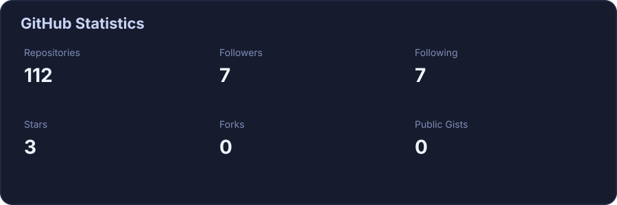
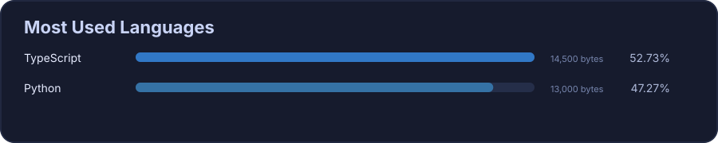
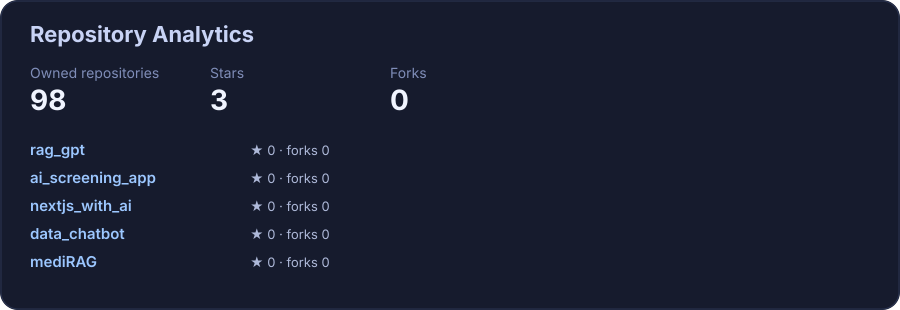
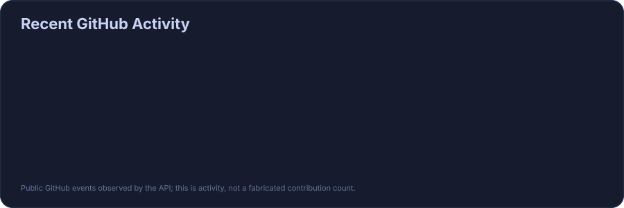

# Abhijit Rajkumar

**AI/ML Engineer · LLM & RAG Engineer · Full-Stack Developer**

I build AI systems and production-oriented web applications around **LLMs, RAG, FastAPI, Next.js, TypeScript, Python, and data engineering**.

## 📊 GitHub Statistics

 

## 💻 Most Used Languages

## 🧠 About Me

- AI/ML and LLM application development
- Retrieval-Augmented Generation (RAG) and semantic search
- FastAPI, Next.js, React, TypeScript and Python
- Data engineering with Hadoop, Spark, Kafka and Airflow
- Cloud and DevOps with AWS, GCP, Docker, Kubernetes and GitHub Actions

## 🛠️ Tech Stack

**Languages:** Python · TypeScript · JavaScript · C · C++ · R · SQL  
**AI/ML:** LangChain · OpenAI · Gemini · HuggingFace · RAG · Pinecone · Qdrant · PyTorch · TensorFlow  
**Full Stack:** Next.js · React · FastAPI · Node.js · Express · Tailwind CSS · Streamlit  
**Databases:** PostgreSQL · MongoDB · MySQL · SQLite · Prisma  
**Big Data:** Hadoop · Spark · PySpark · Kafka · Hive · HDFS · AWS EMR  
**Cloud/DevOps:** AWS · GCP · Docker · Kubernetes · GitHub Actions · Nginx

## 🚀 Featured Projects

### GitHawk
Full-stack AI-powered GitHub Pull Request reviewer using Next.js, Better Auth, PostgreSQL, Pinecone, Gemini and Inngest.

### v0-clone
AI UI generation platform using Next.js, GPT-4.1, Inngest Agent Kit, E2B Sandboxes, Clerk and PostgreSQL.

### Patho-Predict
Genomic variant pathogenicity prediction platform using Next.js, FastAPI, Biopython, UCSC API, ClinVar and Pinecone.

### MediRAG / RAGnosis
Medical document analysis and RAG application using FastAPI, Next.js, LlamaIndex, HuggingFace, Pinecone/FAISS and Docker.

## 🔥 Contribution Activity

 

## 💼 Experience

**AI/ML Intern — Euron (Engagesphere Technology Pvt Ltd)** · Sep 2025 – Apr 2026  
Built MediRAG (RAGnosis), including document ingestion, embeddings, vector search, LLM generation, FastAPI, Next.js and Docker Compose.

**Apprentice — PW Skills** · Jan 2022 – Nov 2023  
Worked on machine-learning solutions for EDA products, EDA workflows and cross-functional engineering collaboration.

**AI/ML Intern — Elite Techno Group** · Jun 2021 – Aug 2021  
Developed a breast cancer prediction model with reported 99.45% classification accuracy and a modular ML pipeline.

## 🎓 Education & Certifications

- **B.Sc. Mathematics — Gurucharan College**, Jun 2013 – Jun 2017
- **Data Science Masters — PW Skills**, Nov 2023
- **Full Stack Developer Cohort (0 to 100) — Harkirat Singh**, Jul 2024
- **Big Data Engineering — Euron**, Sep 2025 – Apr 2026

## 📫 Connect

- [LinkedIn](https://www.linkedin.com/)
- [Portfolio](https://abhijit1102.github.io)
- [GitHub](https://github.com/Abhijit1102)

---

_GitHub statistics are generated locally by Python and refreshed automatically with GitHub Actions. No public GitHub statistics server is used._
